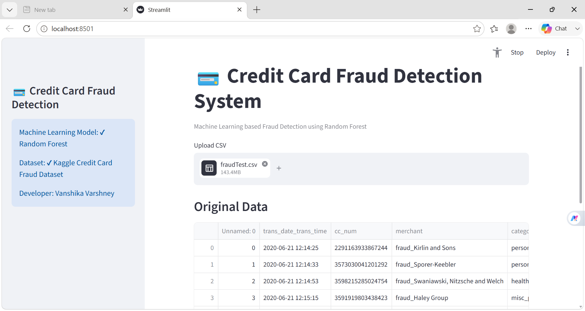
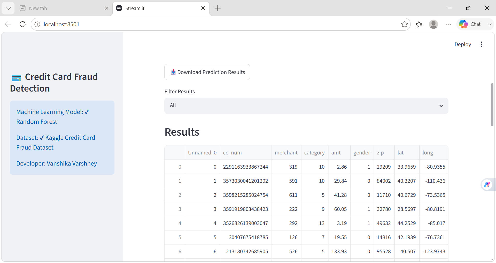

# 💳 Credit Card Fraud Detection System

An end-to-end Machine Learning project that detects fraudulent credit card transactions using the **Random Forest Classifier**. The project includes data preprocessing, handling class imbalance using **SMOTE (Synthetic Minority Oversampling Technique)**, model training, evaluation, and an interactive **Streamlit web application** for real-time fraud prediction.

---

## 🚀 Features

- 📂 Upload transaction CSV file
- 🤖 Fraud detection using Random Forest Classifier
- ⚖️ Balanced the imbalanced dataset using SMOTE (Synthetic Minority Oversampling Technique)
- 📊 Prediction confidence score
- 📈 Interactive dashboard with transaction summary
- 📉 Bar Chart & Pie Chart visualizations
- 📥 Download prediction results as CSV
- 🔍 Feature Importance analysis
- 🌐 Interactive Streamlit web application

---

## 🛠️ Tech Stack

- Python
- Pandas
- NumPy
- Scikit-learn
- Imbalanced-learn (SMOTE)
- Matplotlib
- Streamlit
- Joblib
- Git & GitHub

---

## 🎯 Project Highlights

- ✅ End-to-End Machine Learning Pipeline
- ✅ Data Preprocessing & Feature Engineering
- ✅ Class Imbalance Handling using SMOTE
- ✅ Random Forest Classification
- ✅ Achieved **97% Test Accuracy**
- ✅ Detected **77% Fraudulent Transactions (Recall)**
- ✅ Feature Importance Analysis
- ✅ Interactive Streamlit Dashboard
- ✅ CSV Upload & Batch Prediction
- ✅ Download Prediction Results

---

## 📂 Project Structure

```text
Credit_Card_Fraud_Detection/
│── app.py
│── train_model.py
│── fraud_model.pkl
│── columns.pkl
│── encoders.pkl
│── feature_importance.png
│── requirements.txt
│── README.md
│── screenshots/
│    ├── home.png
│    ├── upload.png
│    ├── results.png
│    └── dashboard.png
└── dataset/
     ├── fraudTrain.csv
     └── fraudTest.csv
```

---

## 📊 Machine Learning Workflow

1. Load Dataset
2. Data Preprocessing
3. Feature Engineering
4. Label Encoding
5. Train-Test Split
6. Apply SMOTE for class balancing
7. Train Random Forest Classifier
8. Evaluate Model Performance
9. Save Trained Model
10. Deploy with Streamlit

---

## 📈 Model Performance

The Random Forest model was trained on a balanced dataset using **SMOTE** and evaluated on the test dataset.

| Metric          |       Value |
| --------------- | ----------: |
| Accuracy        |     **97%** |
| Test Samples    | **259,335** |
| Fraud Recall    |     **77%** |
| Fraud Precision |     **12%** |
| Fraud F1-Score  |     **21%** |

### Classification Report

| Class          | Precision | Recall | F1-Score |
| -------------- | --------: | -----: | -------: |
| Legitimate (0) |      1.00 |   0.97 |     0.98 |
| Fraud (1)      |      0.12 |   0.77 |     0.21 |

> The model prioritizes detecting fraudulent transactions by achieving **77% recall** on the fraud class while maintaining an overall **97% accuracy**.

---

## ▶️ Run Locally

### Clone Repository

```bash
git clone https://github.com/Vanshika-ml/Credit_Card_Fraud_Detection.git
```

### Install Requirements

```bash
pip install -r requirements.txt
```

### Train Model

```bash
python train_model.py
```

### Run Streamlit App

```bash
streamlit run app.py
```

---

## 📸 Project Screenshots

### 🏠 Home Page


---

### 📂 Upload Dataset



---

### 📊 Prediction Results



---

### 📈 Dashboard


---

## 📌 Dataset

This project uses the **Credit Card Fraud Detection Dataset** from Kaggle.

Dataset Link:

https://www.kaggle.com/datasets/kartik2112/fraud-detection

> **Note:** The dataset is not included in this repository because of GitHub file size limitations.

---

## 🌐 Live Demo

🚀 **Streamlit App**

https://creditcardfrauddetection-hndbfg8hpfgead8gu9bcqc.streamlit.app/

---

## 📚 Key Learnings

- Handling highly imbalanced datasets using SMOTE
- Feature Engineering & Data Preprocessing
- Random Forest model optimization
- Model evaluation using Precision, Recall, F1-Score and Accuracy
- Building interactive ML applications using Streamlit
- Version control using Git & GitHub

---

## 🎯 Future Improvements

- Improve fraud precision using threshold tuning
- XGBoost & LightGBM implementation
- Hyperparameter tuning using GridSearchCV
- SHAP Explainability
- Streamlit Cloud Deployment
- REST API using FastAPI
- Real-time Fraud Detection Pipeline

---

## 👩‍💻 Developer

**Vanshika Varshney**

Machine Learning | Data Science | Python Developer

⭐ If you found this project useful, don't forget to **Star** this repository.
